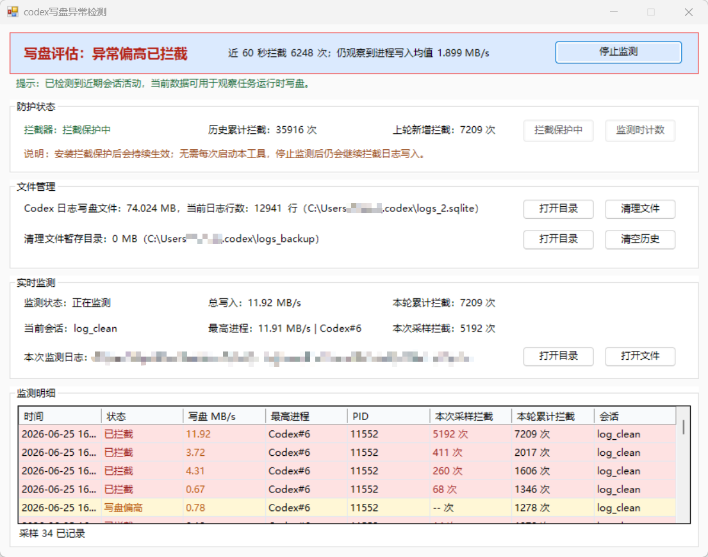

# codex写盘异常检测

一个 Windows 小工具，也可以作为 Codex Skill 使用，用来检查和临时缓解 Codex 本地 `logs_2.sqlite` 异常写盘问题。



## 使用方式

复制给 Codex：

```text
查看项目并运行
https://github.com/DonaldL81/codex-log-guard-skill
```

或者手动双击：

```text
codex写盘异常检测.vbs
```

## Codex Skill 调用

安装或首次运行后，可以直接按下面的说法让 Codex 操作：

```text
想确认 Codex 有没有问题时，可以说：
帮我检查 Codex 有没有问题
帮我检查 Codex 写盘
Codex 最近有点卡，帮我检查一下
监测 2 分钟并生成报告

想清理日志时，可以说：
清理日志文件
关闭 Codex 后自动清理日志

想开启或关闭拦截保护时，可以说：
安装拦截器
卸载拦截器

想快速查看当前状态时，可以说：
查看当前保护状态

想打开图形界面时，可以说：
打开监控面板

想维护备份或检查工具时，可以说：
清空备份历史
运行自检
```

在项目目录中可以直接运行：

```powershell
powershell -NoProfile -ExecutionPolicy Bypass -File .\tools\CodexLogGuardCli.ps1 status
```

常用命令：

```powershell
.\tools\CodexLogGuardCli.ps1 status
.\tools\CodexLogGuardCli.ps1 monitor -DurationSeconds 120
.\tools\CodexLogGuardCli.ps1 open-gui
.\tools\CodexLogGuardCli.ps1 install
.\tools\CodexLogGuardCli.ps1 uninstall
.\tools\CodexLogGuardCli.ps1 deferred-clean
.\tools\CodexLogGuardCli.ps1 clear-backup
.\tools\CodexLogGuardCli.ps1 self-test
```

在 Codex 对话里说“帮我检查 Codex 有没有问题”“帮我检查 Codex 写盘”“Codex 最近有点卡，帮我检查一下”时，默认会监测 2 分钟后给出结论；只说“查看当前保护状态”时，才会快速查看当前状态。

“清理日志文件”和“关闭 Codex 后自动清理日志”是同一个流程，都会启动延迟清理助手。它会打开一个独立 PowerShell 窗口，提示你完全退出 Codex；检测到 Codex 退出后自动清理日志文件，然后等待你重新打开 Codex，等新的 `logs_2.sqlite` 和 `logs` 表生成后自动安装拦截器。

`monitor` 是固定时长监测命令，默认建议 120 秒，每 5 秒采样一次。命令结束后会输出平均写盘、峰值写盘、本轮拦截次数、CSV 记录文件路径和最终保护状态；如果开始时拦截器已安装，监测期间会临时启用计数，结束后恢复纯拦截器。

## 可以做什么

- 检查 Codex 当前写盘是否偏高。
- 一键安装日志拦截保护。
- 清理 Codex 日志写盘文件。
- 打开 GUI 面板实时监测。
- 作为 Codex Skill 时，可直接用命令行检查状态。

## 界面怎么看

顶部 `写盘评估` 是主要结论：

| 状态 | 含义 |
|---|---|
| 未检测 | 还没有开始监测 |
| 观察中 | 样本不足，暂时不下结论 |
| 正常 | 当前写盘较低 |
| 少量偏高 | 写盘略高，需要继续观察 |
| 异常偏高 | 写盘明显偏高，建议安装拦截器 |
| 少量偏高已拦截 | 发现少量日志写入尝试，已被拦截 |
| 异常偏高已拦截 | 发现较多日志写入尝试，已被拦截 |

`防护状态` 显示拦截器是否启用。安装拦截保护后会持续生效，不需要每次打开本工具；停止监测或关闭窗口后仍会继续拦截日志写入。

`文件管理` 可以打开 Codex 日志目录、清理当前日志文件、清空历史备份。清理当前日志前请先完全退出 Codex。

注意：`清理文件` 会把当前 `logs_2.sqlite*` 移动到备份目录，原来安装在这个数据库里的拦截器也会一起被移走。如果 GUI 窗口保持打开且拦截保护处于开启状态，重新打开 Codex 后工具会自动检测新的 `logs_2.sqlite` 和 `logs` 表，并自动重新安装拦截器；如果通过 Codex Skill 清理，延迟清理助手也会等待新日志库生成并自动重新安装拦截器。

`实时监测` 和 `监测明细` 用来观察任务运行时的真实写盘速度和拦截次数。

## 重要说明

- 仅适用于 Windows。
- 工具脚本本身只占用几十 KB。
- 需要系统中可用的 `python` 或 `py -3`，用于读取和修改 SQLite。
- 本工具是临时排查和止血方案，不是 Codex 官方修复。
- 工具不读取用户消息正文、Codex 回复正文、API Key 或 Token。
